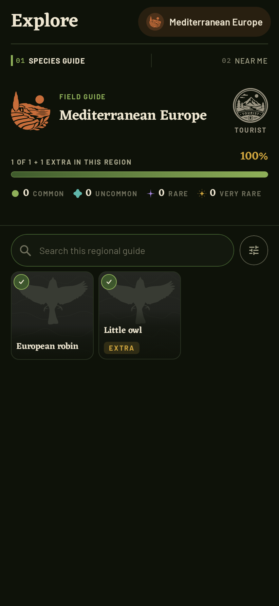
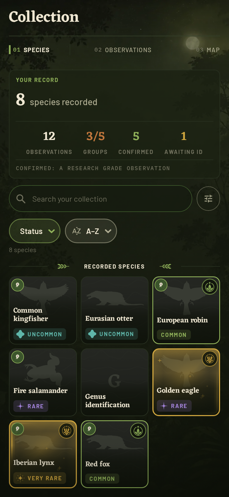
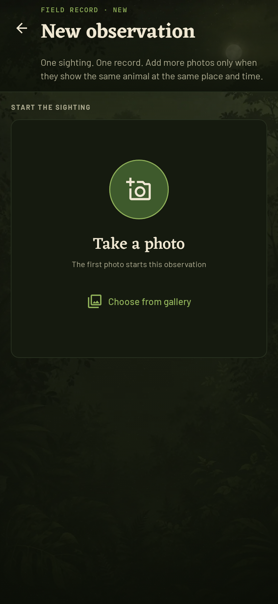
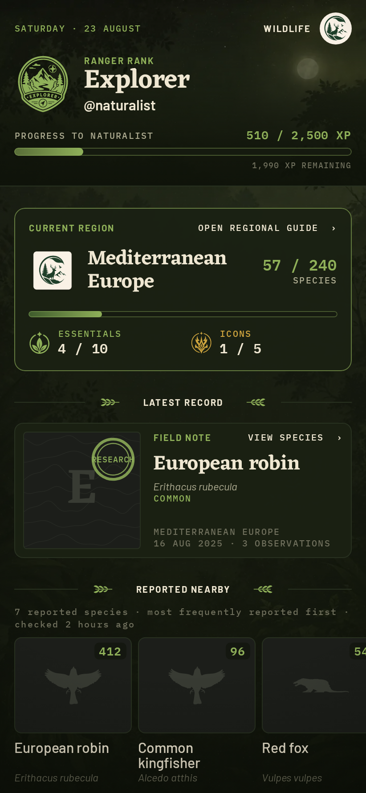

# Wildlife

**Turn real wildlife sightings into a field guide of your own.**

Wildlife is an Android companion for people who like spotting animals and watching their discoveries grow. Explore a regional species guide, record what you find, and build a personal collection from your public [iNaturalist](https://www.inaturalist.org/) observations. Regional goals and ranger progression give each outing a little more purpose, while iNaturalist remains the place where observations are submitted and identified.

> **In development:** Wildlife is an internal Android alpha. It is not on Google Play, and its pilot guides and game balance are still being reviewed.

## Screenshots

| Explore your regional guide | Build your collection |
| --- | --- |
|  |  |
| Start a new sighting | See what your outings have added |
|  |  |

These images render real Jetpack Compose screens with **sample test state**. The usernames, observations, dates, counts, and progress are examples, and the UI is still changing.

## Take the guide into the field

**Find a place to start.** Browse the installed guides for Mediterranean Europe, East Africa, and the Caribbean. Each guide has its own species checklist, encounter-rarity tiers, and Regional Essentials and Icons to discover. Unobserved species remain silhouettes; your recorded finds become part of the guide. You can explore a guide before linking an account, and installed content remains browsable offline.

**Make one sighting count.** Take a photo or choose one from your gallery, add more photos only if they show the same sighting, and check the original time and location. Wildlife opens the official iNaturalist app to finish submission and identification. When the observation becomes public, Wildlife matches it to your draft; uncertain matches wait for your decision.

**Watch your collection grow.** Browse species you have recorded across regions, revisit individual observations, and see your progress on the map. A species outside a regional checklist still joins your collection as an **Extra discovery**. Linked public sightings can earn XP and unlock regional progress; a later Research Grade status has its own confirmation state and reward.

Wildlife uses iNaturalist's public data as the biological source of truth. It never asks for your iNaturalist password or token, and it never creates, edits, or deletes an iNaturalist observation. Account linking uses a temporary code in your public profile bio. Wildlife stores its own collection and game state locally and provides local-data deletion.

## Inside the repository

The Android app is built with **Kotlin, Jetpack Compose, Material 3, SQLite, and WorkManager**. A **Python** authoring pipeline turns reviewed public-source evidence into versioned regional SQLite packs, checks taxonomy and media provenance, and verifies that bundled content matches its inputs. The core app runs on-device; [`backend/`](backend/README.md) is an archived feasibility prototype.

This is a solo project developed with agentic AI assistance. AI tools support implementation and iteration; they are not an in-app species-identification model or a source of biological facts. The [product requirements](docs/Wildlife_prd.md), [UI architecture](docs/ui_architecture.md), and [catalogue workflow](catalogues/README.md) document the decisions and validation rules.

## Build a development APK

Install Android Studio or an Android SDK with **API 35**, and **JDK 17 or newer**. From the repository root on Windows:

```powershell
.\gradlew.bat :app:testDebugUnitTest
.\gradlew.bat :app:assembleDebug
```

The debug APK is written to `app/build/outputs/apk/debug/app-debug.apk`; install it through Android Studio or `adb install -r app/build/outputs/apk/debug/app-debug.apk`. On macOS/Linux, use `./gradlew` instead of `.\gradlew.bat`. The normal observation handoff uses the official iNaturalist app; collection sync and rewards need a linked public account and connectivity.

If catalogue sources change, rebuild the bundled pack before the Android build. The [catalogue workflow](catalogues/README.md) explains the authoring and verification commands.

## Still in progress

The three pilot catalogues, encounter rarity, and progression rules are drafts. Biological and media curation, device and accessibility checks, and closed-beta reliability work remain open. The [roadmap](docs/Wildlife_roadmap.md) and [pilot release audit](catalogues/review/pilot-release-audit.md) track those gates; the audit currently says release ready: **no**. Missing biological facts remain unavailable rather than being invented, and reusable reference media retains source, creator, licence, and attribution.
