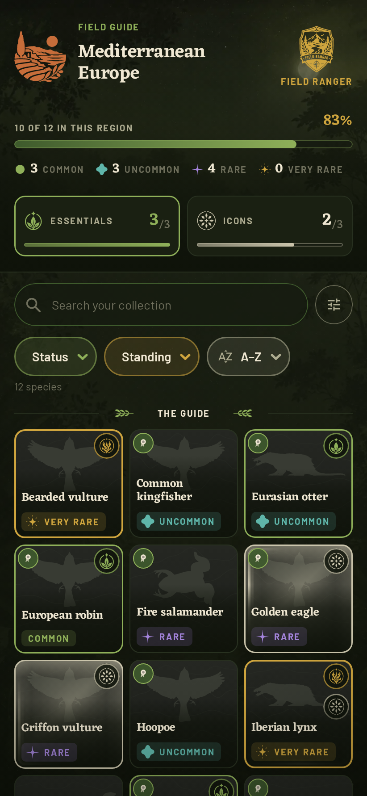
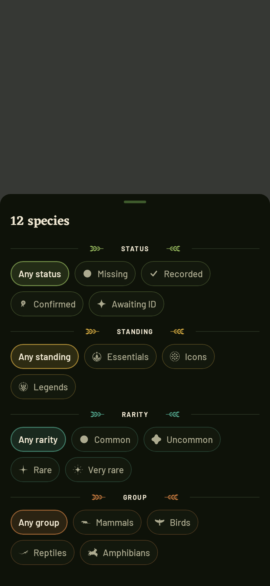

# Wildlife UI Style Guide

**Status:** Adopted visual authority for product-facing UI  
**Implementation contract:** [`ui_architecture.md`](ui_architecture.md)

## 0. Reference use and governance

The two AI-generated images below are mood references for **Field Guide Classic**. They demonstrate visual character, density and hierarchy only. They are not layouts, product requirements, factual content or production image assets.

| Collection mood reference | Species-detail mood reference |
|---|---|
|  |  |

When guidance conflicts, product truth in `Wildlife_prd.md` takes priority, followed by this style guide and then `ui_architecture.md`. Never copy invented facts, species states, counts or AI wildlife images from a concept.

This system applies immediately to new or materially changed product-facing screens. Existing feasibility and account-management screens may stay utilitarian until touched; they must not become competing design systems.

## 1. Direction

**Style name:** Field Guide Classic  
**Primary mode:** Dark  
**Platform:** Android — Kotlin + Jetpack Compose / Material 3  
**Design goal:** A compact digital field guide that feels like a naturalist's reference book, with just enough game language to make collecting wildlife satisfying.

The interface should feel:

- **Natural, warm, and grounded**
- **Compact and information-dense**
- **Scientific without feeling clinical**
- **Game-like without looking like a mobile game**
- **Tactile and field-guide inspired, but still practical to implement in Compose**

The visual hierarchy is:

1. Wildlife photography
2. Common species name
3. Collection / observation state
4. Scientific and reference information
5. Progression / rarity accents

---

## 2. Core Visual Principles

### 2.1 Dark field-guide base

Use near-black surfaces with a very subtle green/olive bias rather than pure black.

The UI should feel like a field guide being used outdoors at dusk, not a generic dark Material app.

### 2.2 Warm reference-book typography

Large headings use a restrained serif face to create the natural-history-book character.

Body copy, navigation, filters, metadata, and controls remain sans-serif for readability.

Do **not** use serif typography everywhere.

### 2.3 Wildlife is the color

Most UI chrome stays muted. Species photography supplies most of the visual richness.

Accent colors are limited to:

- muted olive
- parchment / cream
- warm gold
- small rarity-specific accents

Avoid saturated interface colors.

### 2.4 Compact Pokédex

The collection should prioritize scanning many species quickly.

Observed and missing species use the **same card layout** so the grid remains stable.

Missing species are represented by silhouettes rather than empty placeholders.

### 2.5 Game feedback is secondary

XP, rarity, completion and unlocks should feel embedded in the field guide.

Avoid:

- neon effects
- oversized badges
- fantasy-game panels
- heavy gradients
- excessive particle effects
- arcade-style typography

---

## 3. Color System

These values are implementation targets, not colors sampled from the concept image pixel-for-pixel.

```text
Background              #080B09
Surface                 #0D110D
Surface Elevated        #141810
Surface Warm            #191A11

Outline                 #303126
Outline Subtle          #22261D

Text Primary            #F1E6CF
Text Secondary          #C5B99F
Text Muted              #8F8978

Olive Primary           #7D8530
Olive Strong            #9AA23D
Olive Dark              #4F551D

Parchment               #DFCDAA
Gold                    #D9A441
Gold Strong             #F0AA2A

Success / Confirmed     #78882D
```

### Semantic use

**Background**
- app background
- navigation background
- unobserved card base

**Surface**
- cards
- filter containers
- stat sections
- metadata panels

**Parchment**
- major headings
- prominent icons
- primary neutral accent

**Olive**
- selected controls
- observation state
- progress
- central capture action

**Gold**
- rarity
- collection highlights
- stars
- special discoveries

Do not make gold the default interactive color. It should retain meaning.

---

## 4. Encounter rarity and regional standing

Encounter rarity should be communicated through a **small icon, border, or label**, never by recoloring an entire screen.

```text
Common       #A8A48F
Uncommon     #899A55
Rare         #D39A3D
Very Rare    #C57B3A
```

Always pair color with text or an icon.

**Regional standing** is separate from encounter rarity and has two levels: the region's
10 **Essentials** and its 5 **Icons**. Icon is the higher of the two: use gold (`#CFA53E`)
and the owner-supplied **Icon glyph**. A species can be both `Common` encounter rarity and
a `Regional Icon`. Accessibility text and Species Detail must expose both values rather
than replacing one with the other.

Standing never implies threat, scarcity, Research Grade or biological rarity.

There was formerly a third designation, a `Legendary` prestige tier drawn in the same gold.
It named exactly the region's five Icons and nothing else, so it was removed rather than
kept as a second name for one thing; the Icon standing inherited its glyph and its gold.

---

## 5. Typography

Recommended implementation:

```text
Display:            Eczar (heavy wedge serif, bundled OFL, static weights, Latin subset)
UI / body / labels: Barlow (bundled OFL)
Scientific names:   Barlow Italic
```

**Two families, and only two.** Eczar carries the display moments — screen titles, species
identity, stat numbers and level moments. It replaced Newsreader, which was easy to read
but too neutral to be the app's voice, which in turn replaced Fraunces. Eczar's weight is
the point: the display face has to hold its own against large marks and a painted
background. Barlow carries everything else: body,
metadata, controls, and every small-caps field label. Both are bundled under the SIL Open
Font License (see `docs/licenses/`).

**Ship a static file per weight, never one variable file declared at several weights.**
Compose does not set the `wght` axis for you, so four `Font(...)` entries pointing at one
variable TTF resolve to four identical faces at that file's default weight — every Medium
and Bold in the app renders the same, with the platform synthesising a difference where it
manages one at all. `FontVariation.Settings` is not a reliable fix; separate instances are.

**The display face carries no italic.** The only italic style in the app is
`ScientificNameStyle`, which is set in the body sans, so a display italic would be bundled
weight that nothing draws.

**Subset bundled fonts to the scripts actually drawn.** Eczar ships Devanagari alongside
Latin at 264KB per weight; four full weights would have cost a megabyte of APK for glyphs
that never render. Subset with `fontTools.subset`, keeping Latin, Latin Extended-A,
punctuation, currency and the arrows, plus the `kern`, `liga`, `ccmp`, `mark`, `mkmk`,
`onum` and `tnum` features — dropping `onum`/`tnum` would lose the old-style and tabular
figures the stat rows rely on.

Barlow was chosen over wider grotesques because the design leans heavily on letterspaced
small-caps labels (stat captions, rarity pills, section rules, regional standing), and
because localised strings run longer than their English equivalents and need the room.

Two faces were removed in the Ranger's Journal revision: **Lora**, which duplicated
the display serif at a single size, and **Baloo 2**, whose chunky "game" voice belonged to the
earlier bolder-gamified direction rather than to this one. Controls that used Baloo now
take Barlow through their Material style.

The app sans is declared once, as `BodyFontFamily` in `ui/theme/Type.kt`. Do not reach for
`FontFamily.SansSerif` — that is the system default, not a chosen face.

### Type scale

```text
Display Large       32sp / serif / medium
Display             28sp / serif / medium
Title Large         24sp / serif / medium
Title               20sp / serif / medium

Body Large          16sp / sans
Body                14sp / sans
Label               12sp / sans
Metadata            11–12sp / sans
Scientific name     11–14sp / italic
```

### Rules

- Common species names are always more prominent than scientific names.
- Scientific names are italic.
- Avoid uppercase section headings except for very small labels.
- Keep line lengths short on species detail screens.
- Use tabular numbers for completion values when available.

---

## 6. Spacing

Use a simple 4dp base grid.

```text
4dp    micro spacing
8dp    related elements
12dp   card internal spacing
16dp   normal screen spacing
24dp   section separation
32dp   large structural separation
```

Default horizontal screen padding:

```text
16dp
```

Collection grid gap:

```text
6–8dp
```

Compactness is intentional. Do not inflate spacing to make the app look more "premium."

---

## 7. Shape Language

The design should be softly rounded, not bubbly.

```text
Small controls       8dp
Filter chips         10–12dp
Cards                10–12dp
Large panels         12–16dp
Capture button       circular
```

Avoid large 24–32dp corner radii on ordinary cards.

Thin borders are preferred over heavy elevation.

```text
Border width: 1dp
```

Use tonal separation instead of strong shadows.

---

## 8. Species Photography

Photography should feel like a natural-history field guide rather than stock imagery.

Prefer:

- animal clearly visible
- natural habitat
- muted backgrounds
- slightly warm / earthy grading
- strong subject separation
- no artificial studio backgrounds

### Card treatment

Images should generally fill the card.

Apply a subtle dark scrim at the bottom so labels remain readable.

Do not place text inside opaque blocks over the image unless necessary for accessibility.

---

## 9. Collection Screen

The collection is the visual core of the product.

### Structure

```text
Top bar
Region + completion selector
Taxonomic filter chips
Compact species grid
Bottom navigation
```

### Grid

Use:

```kotlin
LazyVerticalGrid(
    columns = GridCells.Fixed(3)
)
```

Three columns should be the default on normal phone widths.

Use two columns only when accessibility font scaling makes three columns impractical.

### Species card

Each card contains:

```text
Image or silhouette
State / encounter-rarity marker
Optional regional standing glyph
Common name
Scientific name
```

Keep cards compact.

Recommended proportions:

```text
width  ≈ 1
height ≈ 1.25–1.4
```

Do not add buttons inside every card.

The whole card is the tap target.

---

## 10. Species States

### Observed

- user's own image when available
- full-color card
- normal species labels
- subtle observed indicator

### Confirmed / Research Grade

Use a small olive circular microscope indicator. The symbol communicates that
the observation has reached research grade, rather than merely being selected
or completed.

This is a verification state, not a rarity marker.

### Observed but unverified

Use the normal image without the confirmed check.

If clarification is needed, surface the verification label on the detail page rather than cluttering the grid.

### Not observed

- very dark card
- silhouette centered in upper area
- low-contrast species text
- no fake image
- encounter-rarity marker and regional standing may remain visible if known

The missing state should feel mysterious, not disabled.

---

## 11. Silhouettes

Silhouettes are an important part of the collection identity.

Use:

```text
Foreground   #343832
Background   #0B0E0C
```

Characteristics:

- recognizable profile
- realistic proportions
- no internal detail required
- consistent visual weight across species
- centered with generous breathing room

Avoid generic Material animal icons as species silhouettes.

---

## 12. Filter Chips

Filters should resemble small field-guide index tabs.

Unselected:

```text
dark surface
thin outline
parchment text
```

Selected:

```text
warm olive / brown-olive fill
parchment text
```

Prefer horizontal scrolling over multi-line wrapping.

Example:

```text
All | Mammals | Birds | Reptiles | Amphibians | …
```

---

## 13. Species Detail Screen

### Structure

```text
Large hero wildlife image
Navigation actions
Common name
Scientific name
Observation state
Compact scientific facts
User observations
About
Additional scientific sections
```

The top portion should be image-led.

### Hero image

Approximate height:

```text
260–320dp
```

The image can bleed to the top edge.

Use a soft dark fade/scrim only where needed for controls and title transition.

### Species identity

```text
European robin
Erithacus rubecula
```

Common name:
- serif
- prominent

Scientific name:
- sans-serif italic
- muted

### Facts panel

Use one reusable compact grid.

Example:

```text
Rarity        Seen by you       Season
Common        12 times          Year-round

Habitat       Activity          Family
Forests       Day               Muscicapidae
```

Prefer this to separate cards for every statistic.

---

## 14. Observation Strip

User observations appear as compact photo tiles.

Each tile should contain only:

```text
Photo
Date
Optional rarity / favorite marker
```

Use a horizontal `LazyRow`.

Do not reproduce the full observation record here.

A final `+N` tile can open all observations.

---

## 15. Bottom Navigation

Recommended destinations:

```text
Home
Collection
[Capture]
Explore
Profile
```

The center capture action is intentionally visually distinct.

### Capture button

- circular
- olive
- parchment camera icon
- subtle outer ring
- slightly raised relative to navigation bar

Do not make it enormous.

It should be prominent without becoming the visual identity of every screen.

Implementation can remain a normal Compose button layered over the navigation bar; a custom-drawn navigation component is unnecessary.

---

## 16. Icons

Use Material Symbols / Material Icons wherever possible.

Preferred style:

- outlined
- medium stroke
- visually simple
- warm cream tint

Use custom icons only for:

- rarity
- badges
- special collection states
- wildlife silhouettes

This keeps the design maintainable for a solo developer.

---

## 17. Cards and Surfaces

Prefer one reusable base card style:

```text
background: Surface
border: Outline Subtle
corner radius: 10–12dp
elevation: minimal / none
```

Variants should be produced through parameters, not separate custom implementations.

Example:

```kotlin
WildlifeCard(
    selected = false,
    observed = true,
    rarity = Rarity.Rare
)
```

---

## 18. Progress

Progress indicators should be thin and understated.

Examples:

```text
512 / 801 (64%)
████████░░
```

Use olive for normal progression.

Gold is reserved for exceptional progression and the Regional Icon standing.

Avoid large circular progress widgets unless the percentage itself is the focus of the screen.

---

## 19. Motion

Motion should feel like discovery, not arcade feedback.

Recommended:

```text
150–250ms fades
small scale-in on unlock
crossfade silhouette → photograph
subtle card appearance
progress value animation
```

For a newly confirmed species:

1. silhouette fades
2. photograph appears
3. species name brightens
4. small confirmation / XP feedback appears

Keep the sequence under roughly 1 second.

Prefer built-in Compose animation APIs:

```kotlin
AnimatedVisibility
AnimatedContent
animateFloatAsState
animateColorAsState
Crossfade
```

Avoid custom physics or complex particle systems unless the interaction proves important.

---

## 20. Material 3 Usage

Material 3 is the implementation foundation, not the visual identity.

Use:

- `Scaffold`
- `NavigationBar`
- `TopAppBar`
- `LazyVerticalGrid`
- `LazyRow`
- `Card`
- `FilterChip`
- `IconButton`
- `HorizontalDivider`

Customize colors, shapes, typography and spacing through `MaterialTheme`.

Avoid fighting Compose with heavily custom layouts where standard primitives produce the same result.

---

## 21. Compose Theme Structure

Recommended:

```kotlin
@Composable
fun WildlifeTheme(
    darkTheme: Boolean = true,
    content: @Composable () -> Unit
)
```

Keep the normal Material color scheme for standard controls and expose app-specific semantic colors separately.

Example:

```kotlin
data class WildlifeColors(
    val parchment: Color,
    val olive: Color,
    val gold: Color,
    val silhouette: Color,
    val confirmed: Color
)
```

Do not scatter raw hex values throughout composables.

---

## 22. Reusable Component Set

Keep the custom design system deliberately small.

Core components:

```text
WildlifeTopBar
RegionSelector
TaxonFilterRow
SpeciesCard
SpeciesGrid
ObservationTile
SpeciesFactsGrid
CollectionProgress
EncounterRarityIndicator
RegionalStandingIndicator
ObservationStateBadge
CaptureButton
WildlifeBottomBar
SectionHeader
```

Most screens should be compositions of these elements.

Avoid creating custom components for one-off visual differences.

---

## 23. Solo Developer / AI Implementation Rules

The visual design should remain ambitious where it matters and simple everywhere else.

### Spend custom implementation effort on

1. Species cards
2. Silhouette / observed state transition
3. Species detail hero
4. Capture / reward moment
5. Collection progress

### Use standard components for

- settings
- dialogs
- forms
- dropdowns
- permissions
- confirmation screens
- account management
- simple lists

### Prefer

```text
one component + parameters
```

over:

```text
multiple visually similar components
```

Do not introduce:

- custom rendering engines
- elaborate Canvas drawings
- bespoke navigation systems
- complex shader effects
- screen-specific design systems

unless there is a clear product benefit.

---

## 24. Accessibility

The field-guide aesthetic must not reduce usability.

Requirements:

- 48dp minimum interactive target
- support Android font scaling
- no state communicated by color alone
- content descriptions for wildlife images where useful
- sufficient contrast for scientific names
- silhouettes require accessible species labels
- rarity icons require text equivalents
- navigation icons always include labels

When font scaling is large, allow the collection grid to fall back from 3 columns to 2.

---

## 25. What to Avoid

Do **not** drift toward:

### Generic Material app
Bright primary color, white cards, oversized rounded rectangles.

### Fantasy RPG
Ornate badges, shields everywhere, glowing gold, decorative frames.

### Scientific database
Dense tables, cold blues, excessive metadata on the main collection screen.

### Rustic scrapbook
Handwriting fonts, fake tape, torn edges, or skeuomorphic notebook UI. (Restrained paper
grain is permitted under §30; what is ruled out is the craft-scrapbook pastiche, not
printed-paper character as such.)

The intended midpoint is:

> **A modern Android wildlife collection app that feels like carrying a beautiful old field guide.**

---

## 26. Reference Screen Character

> **Superseded by §30.** Collection is the reference screen; see "Collection is the
> reference screen" there. This section is kept for the reasoning behind it.

### Collection

**Feel:** dense, collectible, mysterious.

The user should immediately see:

- how much of the region they have collected
- which species they know
- which remain silhouettes
- which discoveries are special

### Species detail

**Feel:** calm, authoritative, personal.

The user should immediately see:

- the animal
- its identity
- whether they have observed it
- essential biological context
- their own history with that species

---

## 27. Final Design Test

Before adding a new UI treatment, ask:

1. Does this make the wildlife more important, or the interface more important?
2. Would this plausibly belong in a modern field guide?
3. Can it be implemented cleanly with standard Compose primitives?
4. Can it become a reusable component?
5. Does it still work without animation or decoration?

If the answer to 3–5 is repeatedly no, simplify it.

---

## 28. Adopted revision — a bolder game layer

This revision deliberately pushes the collection experience further toward a *collectible
game* feel than the original restrained baseline, while keeping the field-guide soul. It
adjusts, but does not discard, §2.5 and §25.

### Now embraced (previously understated)

- **Eczar display type** for titles, species identity and collection/level headers.
- **Encounter-rarity markers** on species cards, tier-coloured per §4, paired with an
  accessible label. Rare and Very Rare may also tint the card border.
- **Standing glyphs** on Regional Essentials and Icons. The visible label names the
  standing, while screen-reader/detail copy also states the independent encounter rarity
  (for example “Common encounter rarity; Regional Icon”).
- **A collector header** on Collection: region selector, a completion meter, a collector
  rank and an XP figure — the "HUD" the baseline avoided is now welcome, kept compact.
- **Stronger image scrims and taller cards** (width ≈ 1, height ≈ 1.35) so photography and
  labels both read boldly.
- **Warmer, slightly brighter olive/gold accents** for the game moments.

### Field marks

The game layer uses a deliberately small, Wildlife-specific mark language instead of generic
game icons:

- **Encounter rarity:** owner-supplied Uncommon, Rare and Very Rare glyphs; Common intentionally
  has no glyph. Every glyph is paired with a rarity label in TalkBack and on Species Detail.
- **Regional Essential:** owner-supplied Essential artwork, tinted olive.
- **Regional Icon:** owner-supplied artwork, tinted gold. This is the mark originally
  supplied for the Legend tier; when that tier was removed the Icon standing took it over,
  along with the gold, since the tier had only ever named the same five species.

### Still prohibited

Neon, fantasy frames, arcade fonts and hard skeuomorphism (fake tape, torn-off sticky
notes, handwriting faces) remain out. The line is "a beautiful modern field guide with
real game feel," not a mobile arcade game.

**Superseded by §30.** Blanket bans on paper texture, glow and gradients no longer hold —
see §30 for what is now permitted and the constraints on it.

### Placeholder rarity and completion (v1)

Regional cards read the frozen `encounterRarity` field and achievement membership, which
are independent of each other. Unknown rarity stays unmarked and is labelled “under
editorial review” on Species Detail; it must never be presented as Common. Icon standing
remains visually prominent but is never encoded as
biological rarity.

## 29. Regional map and achievement character

Regional progress uses a local world-map polygon layer:

- neutral/dark fill: no progress;
- restrained olive intensity: catalogue completion;
- gold outline or compact `ESS.` stamp: Regional Essentials complete;
- stronger gold `ICON` stamp/label: Regional Icons complete;
- one-time discovery animation only; no continuous glow or pulsing map.

Always provide a legend and textual status. Colour or visual effect alone never communicates
completion. Observation cells remain a separate toggleable layer so personal history does
not become confused with regional catalogue progress.


---

## 30. Adopted revision — Ranger's Journal (2026)

This revision replaces the visual language of §28 while keeping its *intent*: a real game
layer over a field-guide soul. Where §28 pushed brightness and HUD density, this one
pushes **place and craft**. The app should feel like a ranger's field pamphlet studied by
lamplight, not a dark-mode utility.

It supersedes the parts of §5, §26 and §28 it contradicts. Where this section and an
earlier one disagree, this section wins.

### Collection is the reference screen

**Collection is the canonical implementation of this revision. When this document and the
Collection screen disagree, the screen wins — and the document is the thing to fix.**




It supersedes §26 as the reference screen. Those captures are produced by
`CollectionScenarioScreenshotTest` and `FilterSheetScreenshotTest`; regenerate them with

```bash
./gradlew :app:testDebugUnitTest -Proborazzi.test.record=true
```

Every other screen should be brought to it rather than reinterpreting the rules from prose.
What to take, in rough order of how much it matters:

1. **The page** — `FieldGuidePage`, with the painted ground, grain and vignette.
2. **The header** — `RangerHeader`: its own ground fading in from the top, closed by a
   hairline, region emblem and rank badge flanking the name, one headline measure.
3. **The controls** — a built `BasicTextField` search pill, `WildlifeDropdown` selectors
   with per-axis accents, and a filter sheet for anything that will not fit inline.
4. **The plates** — square `SpeciesCard` tiles, caption over the artwork, neutral ground,
   marks large enough to be scanned rather than read.
5. **The type and palette** — Eczar and Barlow, and the tokens in `ui/theme/Color.kt`. Never
   a raw colour or `FontFamily` at a call site.

Screens still to bring across: **Explore, Home, Observations, Profile, SpeciesDetail**. They
inherit the tokens, the card and the type already, but keep bespoke headers and furniture.

Two things on this screen are deliberately not general rules:

- **Filters are four axes** because a collection is browsed by narrowing. A screen with one
  meaningful axis should use one selector, not a sheet.
- **The Icon beacon** is specific to regional standing. It is not a pattern for drawing
  attention to arbitrary items.

### The ground

A **painted moonlit canopy** (`R.drawable.field_guide_background`) sits behind every page,
**fixed rather than scrolling**, so the app reads as a clearing you are standing in. Its
dark, busy edges frame the content and its open, foggy centre is where content lives.

Over it: a vertical scrim for legibility, faint **paper grain**, and a **vignette** so the
light feels local rather than uniform.

The painting replaced the generated topographic contours at page level — two depictions of
terrain fought each other. **Contours remain** in one place only: unfilled species plates,
where they signal "not yet found" rather than describing the page.

### The header

Screens that carry identity open with a **full-bleed header** that sits directly on the page
painting — it draws no scene of its own, only a ground of its own. The app emblem, region
name, progression rank patch and a progress measure sit on it.

This costs roughly a third of a phone viewport, which is correct for Collection and wrong
for busier screens — `RangerHeader` therefore has a **compact variant**. Use it anywhere
identity is not the point of the screen.

### Drawn marks, not icon fonts

Emblems are **drawn as paths**, not taken from Material icons: the app emblem (paw over
peaks and conifers in a double ring), a **rank patch per progression level** whose mark
escalates across the ladder, stat glyphs (tick, sparkle, rosette), and the magnifier and
clear cross that make up the search pill.

Owner-supplied field marks (rarity and regional standing) remain the mark language of §28
and are unchanged in meaning. They now render by parsing the bundled SVG path rather than
through an image loader, so they work offline and tint cleanly.

**Every bundled mark goes through the path layer**, taxon silhouettes included. The last
Coil holdout, `TaxonGroupGlyph`, is gone: an async image loader made the group marks render
inconsistently between screenshot runs, and it put a load on the composition for artwork
that ships in the APK. Use `TaxonSilhouette` (potrace origin) and `FieldMark` (Inkscape
origin). Coil remains for species photography and the map, which are genuinely remote.

**Region emblems** live in `assets/region_marks/<regionKey>.svg` and are tinted with the
region accent from `regionVisual()`. `RegionMark` returns false when a region has no
artwork, and `RegionGlyph` then falls back to the generic icon — regions ship before their
emblems do, and a missing file must never render an empty circle.

### Filters are axes, not one list

Collection filters split into four independent axes — **Status**, **Standing**, **Rarity**
and **Group** — each defaulting to "Any" and combining with AND. They were once a single
nine-option exclusive enum, which made the screen's most useful questions unaskable:
"which Essentials am I still missing?" and "which Icons do I not have yet?" each need two
axes at once.

Rules that follow from the split:

- **Status is one axis, not two.** Confirmed and Awaiting ID are narrower cases of
  Recorded, not peers of Missing. Splitting them out would offer selections that cannot
  describe anything.
- **Rarity offers every tier.** The header teaches four tallies, so the filter has to let
  the user act on all four. (These tiers remain the §4 placeholder, so filtering to one
  presents placeholder data as a definite claim — a known, deliberate exposure.)
- **The matching logic is a pure function.** `CollectionFilters.matches` lives outside any
  composable so combinations are tested directly rather than through the UI.
- **Sort is not a filter** and stays inline; it never narrows the set, so hiding it behind
  the same door as the filters would misrepresent it.
- **Status and Standing are inline too**, being the pair the split exists to combine, with
  Rarity and Group behind the sheet. When a selector's neutral option would read "Any
  standing", the closed pill shows just the axis name via `WildlifeDropdown`'s `pillLabel`
  — four full labels do not fit a phone row. The accessibility label keeps the full text.
- **Marks in a menu are all one size.** Use the bare `FieldMark`, not a matted disc like
  `EncounterTrace`, wherever options sit together: the disc is 30dp against an 18dp glyph
  and makes one option look heavier than its peers.
- **Hidden filters need a count.** The Filters pill carries a badge of the axes currently
  narrowing the grid, or a dismissed sheet leaves invisible state behind.
- **An empty result names the axes that caused it**, so the user knows which one to relax.
- **Clearing is reachable without opening the sheet.** A clear button sits directly beside
  the Filters button and appears only when something is active. When clearing lived only
  inside the sheet, getting back to the full guide meant opening a sheet to press a button
  and dismissing it again: three actions to undo one. It shares a row with Filters rather
  than taking one of its own — a control that appears and disappears must not change the
  height of what is above the grid, or setting a filter shunts the results down the page.
- **"Any" options carry no mark.** An absence of constraint has no symbol to teach, and
  giving it one implies it is a choice like the others.
- **Each axis owns a hue**, in the row and in the sheet: Status moss, Standing brass,
  Rarity verdigris, Group copper (`axisStatus` and friends). With every control on
  `oliveStrong` the row could only be parsed by reading every label. Sort and the Filters
  button are deliberately **achromatic** — that is what separates the controls that narrow
  the grid from the controls that do not.
- **The row does not scroll.** A control the user has to drag sideways to find is a control
  most people never find. Everything fits a phone at default text size.
- **Filters sits beside the search field**, not in the selector row. Typing a name and
  setting an axis are the same intent — narrowing what you are looking at — and the pairing
  leaves the selector row to carry only the axes it displays. It carries no label so the
  search field keeps a usable width; its count badge, being the only trace of filters set
  on a dismissed sheet, is the part that must never be dropped for space.

### Infinite animations and the test clock

Any infinite transition in the tree keeps the Compose test clock permanently busy, so
`waitForIdle` never returns and every screenshot containing that component hangs. Effects
that loop therefore take their phase as a parameter plus an `animated` flag, and screenshot
hosts wrap content in `StillTheme`, which provides `LocalPlateEffectsAnimated = false`.
Pinning the phase also makes captures deterministic, which a running animation would not
be. **Screenshot hosts must use `StillTheme`, never `WildlifeTheme` directly.**

### Selector motion

`WildlifeDropdown` moves on the same terms as the search field (§19):

- **Opening brightens the pill** — fill and border lift together and the leading mark takes
  the same small spring as the search magnifier, so the control and the menu it owns read
  as one object while the menu is up.
- **The menu grows from the edge nearest the pill**, top-left when it hangs below and
  bottom-left when it flips above. `AnchoredBelow` reports which way it went so the
  transform origin can follow; a menu that always grew from its top looked like it was
  arriving over the control rather than out of it.
- **Exit is kept alive by a `MutableTransitionState`.** Tying the `Popup` to `expanded`
  directly tears it down on dismissal and the exit transition never plays — the popup must
  stay mounted while `currentState || targetState`.

### Menus anchor to their control

`WildlifeDropdown` wraps its pill and its `Popup` in one `Box` and supplies an
`AnchoredBelow` position provider. Without the wrapper a `Popup` takes its position from
whatever laid the selector out, so every menu in a filter row opened at that row's left
edge rather than under the control that was tapped. The provider also clamps to the window
and flips above the anchor when there is no room below, which is what lets a selector sit
at the right edge of the screen at all.

### Inputs are built, not themed

`CollectionSearchBar` is a `BasicTextField` with its own decoration, not a themed
`OutlinedTextField`. Material's field carries chrome that no colour override reaches — a
notched label slot, a 56dp floor and fixed internal padding — which left it reading as
stock Material next to hand-built controls. Reach for `BasicTextField` whenever a field
has to sit in this family.

Its motion follows §19 — 120–180ms, no bounce beyond a single spring on the magnifier:

- **Focus** moves border colour, border width and glyph colour together, plus a small
  scale on the magnifier. One coordinated change, so the pill resolves as one object.
- **The placeholder fades and lifts** instead of blinking off on the first keystroke; at
  typing speed the instant swap read as a glitch.
- **The clear control grows in from the centre** and expands its width, so the text does
  not appear to jump sideways as the control claims its space.

Note that inside the field's `Row`, the RowScope overload of `AnimatedVisibility` wins
resolution and cannot animate a child of the inner `Box` — the placeholder is its own
composable for that reason, not by accident.

The pill shares `CircleShape` and the olive border language with `WildlifeDropdown`, but
sits **quieter at rest**: a placeholder is not a choice the user has made, so the search
field should not look as committed as a filter that is actively set. Focus is what
promotes it — border to `oliveStrong`, width to match the selectors, glyph from faint
parchment to olive, all animated together so the pill resolves as one object.

Affordances appear only when they apply: the clear cross is absent, not disabled, while
the field is empty.

### The grid is scanned, not read

Phones show **three plates across**. A guide is browsed by sweeping the page, so seeing
more of the region at once beats caption width — the marks do the identifying and the
caption carries only the name. Large text scales drop a column rather than letting
captions overrun their plates.

**Cards are square** (`speciesCardAspectRatio`), because the **caption sits over the
plate**, not under it. With no fixed block of text to make room for, the tile can be the
artwork's own shape. One column is the exception — a full-width square would be an enormous
tile — and stays a little taller than wide.

This reverses the earlier decision to move captions below the plate. That decision was
right for two wide columns and wrong for three narrow ones: a caption block that costs a
fixed number of lines whatever the width squeezes a narrow plate to a letterboxed band, and
any attempt to square the card made it worse.

What this costs, and what pays for it:

- **The marks grew.** Standing chips are 29dp with an 18dp mark; the rarity pill's mark is
  15dp. At three columns these, not the words, are what a scan actually lands on.
- **The taxon chip is gone.** The silhouette on the plate already says which group it is;
  the chip repeated the same fact inside the same picture.
- **"Not yet recorded" is gone.** An empty plate with a silhouette says it.
- **The observation count is gone** from the card. It was the least load-bearing thing in
  the caption and the first thing to drop once the caption had to share space with artwork.
- **The caption is a gradient, not a band.** A hard edge across the tile would reintroduce
  the two-part card the square shape exists to remove.
- **Artwork is inset from the caption** (`CaptionInset`). A silhouette that fills the
  square outright puts half of every bird behind its own name.
- **Plates are near-neutral, not another green.** With a painted forest behind them and
  green marks, borders and controls on top, olive cards left the whole screen reading as
  one colour. `plate`/`plateHigh`/`plateContour` carry a touch of warmth so they do not go
  cold slate, and the silhouette is neutral for the same reason — a green animal on a grey
  plate reintroduces exactly the colour the plate exists to avoid. Green stays where it
  means something: standing frames, marks and controls.
- **Standing marks sit top-right, record status top-left.** Standing is the card's
  headline — the frame colour and the gilding carry it too — so it takes the corner the eye
  rests on when sweeping a row. Photo credit follows status to the left, since the right
  column can stack both standing marks.

### Rarity and standing say different things

This is the rule that keeps a plate from repeating itself:

- **Rarity** is carried by the **pill** under the plate — mark plus word, so the mark is
  teachable. Common deliberately has no mark.
- **Regional standing** is carried by the **card frame**: moss for Essential, **gold** for
  Icon. A recorded Icon is both lit and gilded.

  Icon is gold (`WildlifeIcon`, the same value as `WildlifeGold`). It was briefly a bone
  tone, because a separate Legend tier held the gold and two standings could not share one
  material. With that tier gone the gold returned to the top standing, where it belongs —
  and it must stay distinct from parchment body text, which is what bone failed at.

- **An Icon is lit and, once earned, gilded.** `IconHalo` puts a gold halo behind the
  specimen and `EdgeLight` runs a bead of light around the frame; `Gilding` lays a warm
  corner glow and gold motes over a plate you have actually recorded. These stack on one
  standing rather than separating two: the difference they draw is between a target and a
  specimen you hold, not between two ranks.
- **The Icon effect moves.** A static halo is easy to miss among nine still plates; the
  travelling bead is what makes the card catch the eye. `EdgeLight` takes its phase as a
  parameter and an `animated` flag rather than owning an infinite transition outright —
  see below.
- **The bead runs inside the frame, not on it.** Drawn at the card's edge it lands in the
  same band as the standing border, and a brass-framed plate hides it completely. It is
  inset past the border and drawn in three passes — wide bloom, body, crisp core — because
  a single stroke reads as a moving hairline rather than as light.
- **Every card gets its own start and speed.** A grid of beads launched together pulses in
  unison and reads as one machine rather than several specimens catching the light. The
  offset and period are derived from the species key via `stableFraction`, never from a
  fresh random: a random taken during composition jumps on recomposition and makes
  screenshots differ between runs. The hash is avalanched first — collection keys are
  near-sequential, and raw hashes of `taxon:1000` and `taxon:1001` differ only in their low
  bits, which would leave a whole row nearly in step.
- **Gilding is earned; the Icon beacon is not.** These are different claims. Gold motes on
  a species you have never seen read as a trophy you own, so `Gilding` is gated on
  `SpeciesCardModel.collected`. An Icon's standing says "this is one of the notable species
  here", which is most useful *before* you find it, so the travelling light runs on every
  Icon — quieter (62%) while it is still a target, so a beacon never outshines a plate that
  has been earned. Recording one adds the halo, so a specimen you hold is **lit** rather
  than merely **flagged**.

Do not colour a card border by rarity. That was the old behaviour and it made standing and
difficulty indistinguishable.

### Separating the header from the page

Both surfaces share one painted background, so the header has to earn its separation
rather than inherit it. It does that with a ground of its own — transparent at the top so
the moon and canopy stay open behind the region name, settling to near-solid by the time
it reaches the quest badges — closed by a **plain 1dp hairline**.

The separation is carried by the value step, not by the rule. A torn-paper edge was tried
here and rejected: a decorative boundary makes the seam the most interesting thing on the
screen, which is the opposite of what a boundary is for. `TornEdge` has been deleted from
the art layer along with the generated `LandscapeScene` and `PineRidge` the painting
superseded, and the five sky/ridge/moonlight tokens that existed only to colour them.

### Now permitted, with constraints

- **Glow** — only as atmosphere in the page painting (the moon) or as gilding on a
  recorded Regional Icon. Never on ordinary controls, never as a focus or press state.
- **Gradients** — for scrims, header grounds and progress fills. Not as surface
  decoration.
- **Paper grain** — see the ground, above.
- **A shield rank patch** — one, in the header, tied to real progression. "Shields
  everywhere" from §28 remains prohibited.

The test for all four: *is this depicting the natural world or the earned state of the
collection?* If it is decorating a control, remove it.

### Grid geometry

Superseded by §30: cards are square tiles with the caption laid over the plate, phones show
**three columns**, and wider layouts go to four.
