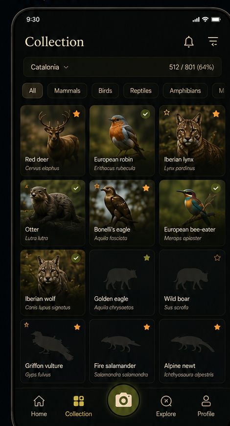
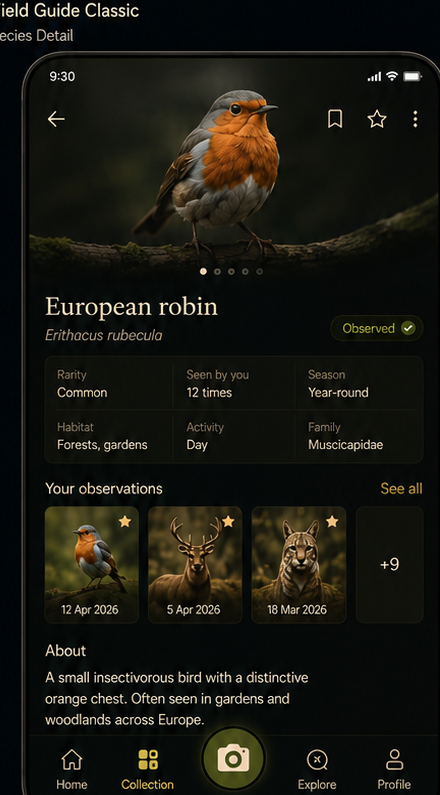

# Wildlife UI Style Guide

**Status:** Adopted visual authority for product-facing UI  
**Implementation contract:** [`ui_architecture.md`](ui_architecture.md)

## 0. Reference use and governance

The two AI-generated images below are mood references for **Field Guide Classic**. They demonstrate visual character, density and hierarchy only. They are not layouts, product requirements, factual content or production image assets.

| Collection mood reference | Species-detail mood reference |
|---|---|
|  |  |

When guidance conflicts, product truth in `Wildlife_prd.md` takes priority, followed by this style guide and then `ui_architecture.md`. Never copy invented facts, species states, counts or AI wildlife images from a concept.

This system applies immediately to new or materially changed product-facing screens. Existing feasibility and account-management screens may stay utilitarian until touched; they must not become competing design systems.

## 1. Direction

**Style name:** Field Guide Classic  
**Primary mode:** Dark  
**Platform:** Android — Kotlin + Jetpack Compose / Material 3  
**Design goal:** A compact digital field guide that feels like a naturalist's reference book, with just enough game language to make collecting wildlife satisfying.

The interface should feel:

- **Natural, warm, and grounded**
- **Compact and information-dense**
- **Scientific without feeling clinical**
- **Game-like without looking like a mobile game**
- **Tactile and field-guide inspired, but still practical to implement in Compose**

The visual hierarchy is:

1. Wildlife photography
2. Common species name
3. Collection / observation state
4. Scientific and reference information
5. Progression / rarity accents

---

## 2. Core Visual Principles

### 2.1 Dark field-guide base

Use near-black surfaces with a very subtle green/olive bias rather than pure black.

The UI should feel like a field guide being used outdoors at dusk, not a generic dark Material app.

### 2.2 Warm reference-book typography

Large headings use a restrained serif face to create the natural-history-book character.

Body copy, navigation, filters, metadata, and controls remain sans-serif for readability.

Do **not** use serif typography everywhere.

### 2.3 Wildlife is the color

Most UI chrome stays muted. Species photography supplies most of the visual richness.

Accent colors are limited to:

- muted olive
- parchment / cream
- warm gold
- small rarity-specific accents

Avoid saturated interface colors.

### 2.4 Compact Pokédex

The collection should prioritize scanning many species quickly.

Observed and missing species use the **same card layout** so the grid remains stable.

Missing species are represented by silhouettes rather than empty placeholders.

### 2.5 Game feedback is secondary

XP, rarity, completion and unlocks should feel embedded in the field guide.

Avoid:

- neon effects
- oversized badges
- fantasy-game panels
- heavy gradients
- excessive particle effects
- arcade-style typography

---

## 3. Color System

These values are implementation targets, not colors sampled from the concept image pixel-for-pixel.

```text
Background              #080B09
Surface                 #0D110D
Surface Elevated        #141810
Surface Warm            #191A11

Outline                 #303126
Outline Subtle          #22261D

Text Primary            #F1E6CF
Text Secondary          #C5B99F
Text Muted              #8F8978

Olive Primary           #7D8530
Olive Strong            #9AA23D
Olive Dark              #4F551D

Parchment               #DFCDAA
Gold                    #D9A441
Gold Strong             #F0AA2A

Success / Confirmed     #78882D
```

### Semantic use

**Background**
- app background
- navigation background
- unobserved card base

**Surface**
- cards
- filter containers
- stat sections
- metadata panels

**Parchment**
- major headings
- prominent icons
- primary neutral accent

**Olive**
- selected controls
- observation state
- progress
- central capture action

**Gold**
- rarity
- collection highlights
- stars
- special discoveries

Do not make gold the default interactive color. It should retain meaning.

---

## 4. Rarity Colors

Rarity should be communicated through a **small icon, border, or label**, never by recoloring an entire screen.

```text
Common       #A8A48F
Uncommon     #899A55
Rare         #D39A3D
Very Rare    #C57B3A
Legendary    #A66C91
```

Always pair color with text or an icon.

---

## 5. Typography

Recommended implementation:

```text
Display titles:     Fraunces (expressive variable serif, bundled OFL)
Secondary headings: Lora
UI / body:          Roboto / system sans
Scientific names:   sans Italic
```

Fraunces carries the large display moments — screen titles, species identity, level and
collection headers — giving the field guide a warmer, more collectible character. Lora
remains the calmer secondary serif; sans stays for body, metadata and controls. Both serif
faces are bundled under the SIL Open Font License (see `docs/licenses/`).

### Type scale

```text
Display Large       32sp / serif / medium
Display             28sp / serif / medium
Title Large         24sp / serif / medium
Title               20sp / serif / medium

Body Large          16sp / sans
Body                14sp / sans
Label               12sp / sans
Metadata            11–12sp / sans
Scientific name     11–14sp / italic
```

### Rules

- Common species names are always more prominent than scientific names.
- Scientific names are italic.
- Avoid uppercase section headings except for very small labels.
- Keep line lengths short on species detail screens.
- Use tabular numbers for completion values when available.

---

## 6. Spacing

Use a simple 4dp base grid.

```text
4dp    micro spacing
8dp    related elements
12dp   card internal spacing
16dp   normal screen spacing
24dp   section separation
32dp   large structural separation
```

Default horizontal screen padding:

```text
16dp
```

Collection grid gap:

```text
6–8dp
```

Compactness is intentional. Do not inflate spacing to make the app look more "premium."

---

## 7. Shape Language

The design should be softly rounded, not bubbly.

```text
Small controls       8dp
Filter chips         10–12dp
Cards                10–12dp
Large panels         12–16dp
Capture button       circular
```

Avoid large 24–32dp corner radii on ordinary cards.

Thin borders are preferred over heavy elevation.

```text
Border width: 1dp
```

Use tonal separation instead of strong shadows.

---

## 8. Species Photography

Photography should feel like a natural-history field guide rather than stock imagery.

Prefer:

- animal clearly visible
- natural habitat
- muted backgrounds
- slightly warm / earthy grading
- strong subject separation
- no artificial studio backgrounds

### Card treatment

Images should generally fill the card.

Apply a subtle dark scrim at the bottom so labels remain readable.

Do not place text inside opaque blocks over the image unless necessary for accessibility.

---

## 9. Collection Screen

The collection is the visual core of the product.

### Structure

```text
Top bar
Region + completion selector
Taxonomic filter chips
Compact species grid
Bottom navigation
```

### Grid

Use:

```kotlin
LazyVerticalGrid(
    columns = GridCells.Fixed(3)
)
```

Three columns should be the default on normal phone widths.

Use two columns only when accessibility font scaling makes three columns impractical.

### Species card

Each card contains:

```text
Image or silhouette
State / rarity marker
Common name
Scientific name
```

Keep cards compact.

Recommended proportions:

```text
width  ≈ 1
height ≈ 1.25–1.4
```

Do not add buttons inside every card.

The whole card is the tap target.

---

## 10. Species States

### Observed

- user's own image when available
- full-color card
- normal species labels
- subtle observed indicator

### Confirmed / Research Grade

Use a small olive circular microscope indicator. The symbol communicates that
the observation has reached research grade, rather than merely being selected
or completed.

This is a verification state, not a rarity marker.

### Observed but unverified

Use the normal image without the confirmed check.

If clarification is needed, surface the verification label on the detail page rather than cluttering the grid.

### Not observed

- very dark card
- silhouette centered in upper area
- low-contrast species text
- no fake image
- rarity marker may remain visible if rarity is known

The missing state should feel mysterious, not disabled.

---

## 11. Silhouettes

Silhouettes are an important part of the collection identity.

Use:

```text
Foreground   #343832
Background   #0B0E0C
```

Characteristics:

- recognizable profile
- realistic proportions
- no internal detail required
- consistent visual weight across species
- centered with generous breathing room

Avoid generic Material animal icons as species silhouettes.

---

## 12. Filter Chips

Filters should resemble small field-guide index tabs.

Unselected:

```text
dark surface
thin outline
parchment text
```

Selected:

```text
warm olive / brown-olive fill
parchment text
```

Prefer horizontal scrolling over multi-line wrapping.

Example:

```text
All | Mammals | Birds | Reptiles | Amphibians | …
```

---

## 13. Species Detail Screen

### Structure

```text
Large hero wildlife image
Navigation actions
Common name
Scientific name
Observation state
Compact scientific facts
User observations
About
Additional scientific sections
```

The top portion should be image-led.

### Hero image

Approximate height:

```text
260–320dp
```

The image can bleed to the top edge.

Use a soft dark fade/scrim only where needed for controls and title transition.

### Species identity

```text
European robin
Erithacus rubecula
```

Common name:
- serif
- prominent

Scientific name:
- sans-serif italic
- muted

### Facts panel

Use one reusable compact grid.

Example:

```text
Rarity        Seen by you       Season
Common        12 times          Year-round

Habitat       Activity          Family
Forests       Day               Muscicapidae
```

Prefer this to separate cards for every statistic.

---

## 14. Observation Strip

User observations appear as compact photo tiles.

Each tile should contain only:

```text
Photo
Date
Optional rarity / favorite marker
```

Use a horizontal `LazyRow`.

Do not reproduce the full observation record here.

A final `+N` tile can open all observations.

---

## 15. Bottom Navigation

Recommended destinations:

```text
Home
Collection
[Capture]
Explore
Profile
```

The center capture action is intentionally visually distinct.

### Capture button

- circular
- olive
- parchment camera icon
- subtle outer ring
- slightly raised relative to navigation bar

Do not make it enormous.

It should be prominent without becoming the visual identity of every screen.

Implementation can remain a normal Compose button layered over the navigation bar; a custom-drawn navigation component is unnecessary.

---

## 16. Icons

Use Material Symbols / Material Icons wherever possible.

Preferred style:

- outlined
- medium stroke
- visually simple
- warm cream tint

Use custom icons only for:

- rarity
- badges
- special collection states
- wildlife silhouettes

This keeps the design maintainable for a solo developer.

---

## 17. Cards and Surfaces

Prefer one reusable base card style:

```text
background: Surface
border: Outline Subtle
corner radius: 10–12dp
elevation: minimal / none
```

Variants should be produced through parameters, not separate custom implementations.

Example:

```kotlin
WildlifeCard(
    selected = false,
    observed = true,
    rarity = Rarity.Rare
)
```

---

## 18. Progress

Progress indicators should be thin and understated.

Examples:

```text
512 / 801 (64%)
████████░░
```

Use olive for normal progression.

Gold is reserved for exceptional / rarity-related progression.

Avoid large circular progress widgets unless the percentage itself is the focus of the screen.

---

## 19. Motion

Motion should feel like discovery, not arcade feedback.

Recommended:

```text
150–250ms fades
small scale-in on unlock
crossfade silhouette → photograph
subtle card appearance
progress value animation
```

For a newly confirmed species:

1. silhouette fades
2. photograph appears
3. species name brightens
4. small confirmation / XP feedback appears

Keep the sequence under roughly 1 second.

Prefer built-in Compose animation APIs:

```kotlin
AnimatedVisibility
AnimatedContent
animateFloatAsState
animateColorAsState
Crossfade
```

Avoid custom physics or complex particle systems unless the interaction proves important.

---

## 20. Material 3 Usage

Material 3 is the implementation foundation, not the visual identity.

Use:

- `Scaffold`
- `NavigationBar`
- `TopAppBar`
- `LazyVerticalGrid`
- `LazyRow`
- `Card`
- `FilterChip`
- `IconButton`
- `HorizontalDivider`

Customize colors, shapes, typography and spacing through `MaterialTheme`.

Avoid fighting Compose with heavily custom layouts where standard primitives produce the same result.

---

## 21. Compose Theme Structure

Recommended:

```kotlin
@Composable
fun WildlifeTheme(
    darkTheme: Boolean = true,
    content: @Composable () -> Unit
)
```

Keep the normal Material color scheme for standard controls and expose app-specific semantic colors separately.

Example:

```kotlin
data class WildlifeColors(
    val parchment: Color,
    val olive: Color,
    val gold: Color,
    val silhouette: Color,
    val confirmed: Color
)
```

Do not scatter raw hex values throughout composables.

---

## 22. Reusable Component Set

Keep the custom design system deliberately small.

Core components:

```text
WildlifeTopBar
RegionSelector
TaxonFilterRow
SpeciesCard
SpeciesGrid
ObservationTile
SpeciesFactsGrid
CollectionProgress
RarityIndicator
ObservationStateBadge
CaptureButton
WildlifeBottomBar
SectionHeader
```

Most screens should be compositions of these elements.

Avoid creating custom components for one-off visual differences.

---

## 23. Solo Developer / AI Implementation Rules

The visual design should remain ambitious where it matters and simple everywhere else.

### Spend custom implementation effort on

1. Species cards
2. Silhouette / observed state transition
3. Species detail hero
4. Capture / reward moment
5. Collection progress

### Use standard components for

- settings
- dialogs
- forms
- dropdowns
- permissions
- confirmation screens
- account management
- simple lists

### Prefer

```text
one component + parameters
```

over:

```text
multiple visually similar components
```

Do not introduce:

- custom rendering engines
- elaborate Canvas drawings
- bespoke navigation systems
- complex shader effects
- screen-specific design systems

unless there is a clear product benefit.

---

## 24. Accessibility

The field-guide aesthetic must not reduce usability.

Requirements:

- 48dp minimum interactive target
- support Android font scaling
- no state communicated by color alone
- content descriptions for wildlife images where useful
- sufficient contrast for scientific names
- silhouettes require accessible species labels
- rarity icons require text equivalents
- navigation icons always include labels

When font scaling is large, allow the collection grid to fall back from 3 columns to 2.

---

## 25. What to Avoid

Do **not** drift toward:

### Generic Material app
Bright primary color, white cards, oversized rounded rectangles.

### Fantasy RPG
Ornate badges, shields everywhere, glowing gold, decorative frames.

### Scientific database
Dense tables, cold blues, excessive metadata on the main collection screen.

### Rustic scrapbook
Heavy paper textures, handwriting fonts, torn edges, fake tape or skeuomorphic notebook UI.

The intended midpoint is:

> **A modern Android wildlife collection app that feels like carrying a beautiful old field guide.**

---

## 26. Reference Screen Character

### Collection

**Feel:** dense, collectible, mysterious.

The user should immediately see:

- how much of the region they have collected
- which species they know
- which remain silhouettes
- which discoveries are special

### Species detail

**Feel:** calm, authoritative, personal.

The user should immediately see:

- the animal
- its identity
- whether they have observed it
- essential biological context
- their own history with that species

---

## 27. Final Design Test

Before adding a new UI treatment, ask:

1. Does this make the wildlife more important, or the interface more important?
2. Would this plausibly belong in a modern field guide?
3. Can it be implemented cleanly with standard Compose primitives?
4. Can it become a reusable component?
5. Does it still work without animation or decoration?

If the answer to 3–5 is repeatedly no, simplify it.

---

## 28. Adopted revision — a bolder game layer

This revision deliberately pushes the collection experience further toward a *collectible
game* feel than the original restrained baseline, while keeping the field-guide soul. It
adjusts, but does not discard, §2.5 and §25.

### Now embraced (previously understated)

- **Fraunces display type** for titles, species identity and collection/level headers.
- **Rarity stars** on species cards (top-left), tier-coloured per §4, paired with an
  accessible label. High tiers (Rare and above) may also tint the card border.
- **A collector header** on Collection: region selector, a completion meter, a collector
  rank and an XP figure — the "HUD" the baseline avoided is now welcome, kept compact.
- **Stronger image scrims and taller cards** (width ≈ 1, height ≈ 1.35) so photography and
  labels both read boldly.
- **Warmer, slightly brighter olive/gold accents** for the game moments.

### Still prohibited

Neon, glow, particle systems, animated gradients, fantasy shields/frames, arcade fonts and
paper-texture skeuomorphism remain out. The line is "a beautiful modern field guide with
real game feel," not a mobile arcade game.

### Placeholder rarity and completion (v1)

Until the catalogue denominator is frozen and a reviewed seasonal rarity snapshot exists
(PRD §6.1, §7.1), rarity tiers and regional completion are a **labelled visual placeholder**:

- Rarity is derived deterministically from a stable species key (`sampleRarityFor`), never
  from biological data, and the screen states it is a sample.
- Completion meters show real observed counts against a clearly-labelled *provisional*
  target, never a curated total or a claim of true regional completeness.

When real rarity and a frozen catalogue land, these placeholders are replaced in place with
no visual change to the component contracts.
